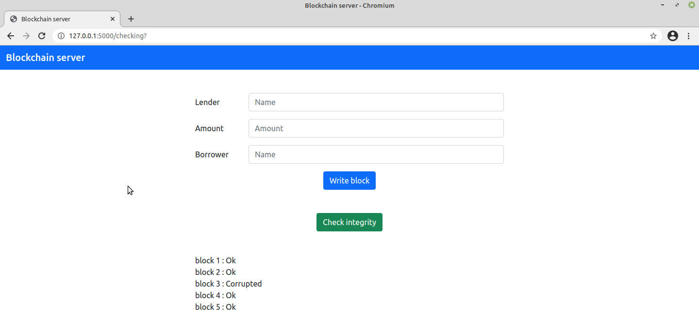

# blockchain_server

The simple blockchain server is made by with the help of Flask

## Description

  

<b>The chart shows how blockchain works</b>

## Installation for Linux*:

1. Clone the repository (or download the zip file and extract it):

    $ `git clone git@github.com:maninserg/blockchain_server.git`
    
2. Go to the directory of the program:
   
    $ `cd <your name of directory>`

2. Create of a virtual environment:

    $ `python3 -m venv .venv`
    
3. Activate the virtual environment:

    $ `source .venv/bin/activate`

3. Install necessary packages using pip according to the requirements.txt file from a directory with the program:

    (.venv) $ `pip install -r requirements.txt`

<i>*The installation for MacOS or Windows can be other</i>

## Screenshots

  

<b>The blockchain server</b>

